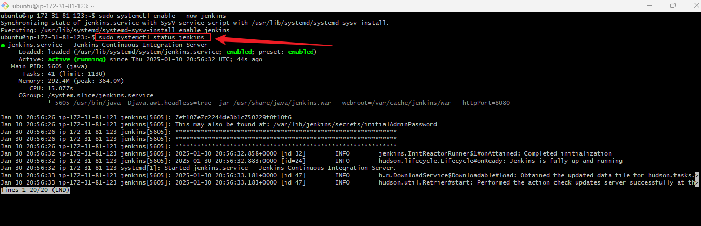
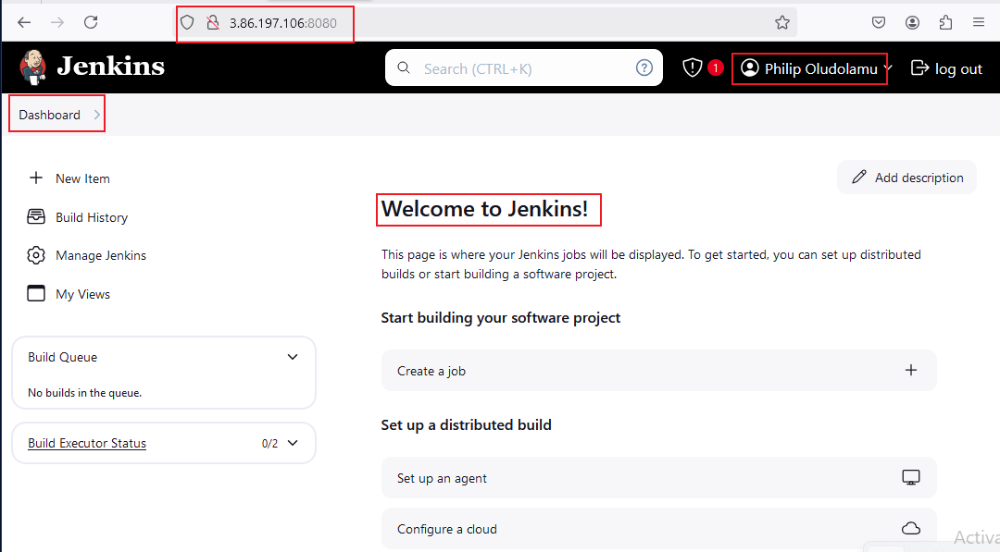
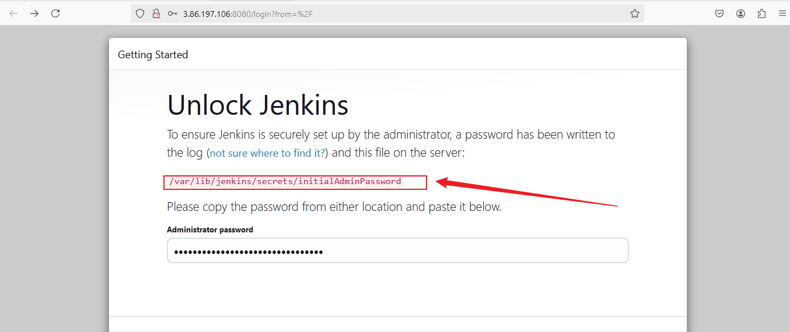
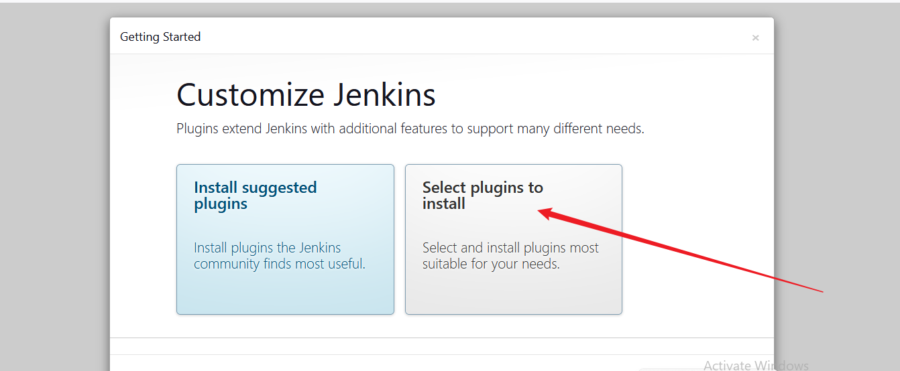
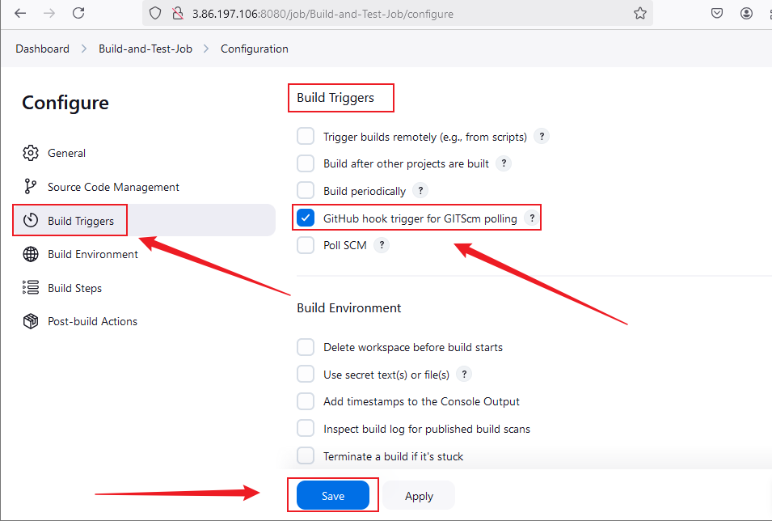

# **Mini Project: Introduction to CI/CD with Jenkins**


## **Project Overview**

This project provides hands-on experience in implementing Continuous Integration (CI) and Continuous Delivery (CD) using Jenkins. It guides learners through the process of automating software builds, running automated tests, and deploying applications, thereby fostering a practical understanding of CI/CD pipelines in real-world software development.

## **Why is this project relevant**

CI/CD has become a cornerstone of modern software engineering, enabling teams to release software rapidly and reliably. Mastering Jenkins and CI/CD principles equips learners with the skills to automate workflows, reduce errors, and improve overall development efficiency—highly sought-after competencies in DevOps roles.

## **Project Goals and Objectives**

By completing this project, learners will:

* Understand CI/CD principles and their role in improving software development processes.
* Gain hands-on experience with Jenkins installation, configuration, and usage.
* Automate software builds, testing, and deployment processes.
* Apply best practices in CI/CD, including parameterized builds, integration with external tools, and leveraging containerization technologies like Docker.

## **Prerequisites**

* Completion of Foundations Core Programs 1–3.
* Basic understanding of Linux commands and system administration.
* Familiarity with software development and version control (Git).

## **Project Deliverables**

* Fully configured Jenkins instance running on a server.
* A set of Jenkins jobs (Freestyle and Pipeline).
* Automated build, test, and deployment pipeline scripts.
* Project directory with well-structured folders and documentation.

## **Tools & Technologies Used**

* Jenkins
* Docker
* Linux (Ubuntu)
* Git
* Web browser for Jenkins console
* Security groups for network configuration

## **Project Components**

1. Jenkins installation and setup
2. Jenkins job creation (Freestyle & Pipeline)
3. Source code management integration
4. Build triggers configuration
5. Pipeline scripting
6. Docker containerization
7. Deployment automation

## **Task 1: Project Directory Setup**

**Objective:** Create a structured project directory to organize all project files, scripts, documentation, and assets.

### **Steps:**

#### 1. **Create Project Root Directory**

```bash
mkdir 09-jenkins-cicd-pipeline
cd 09-jenkins-cicd-pipeline
```

#### 2. **Create Sub-Directories**

```bash
mkdir docs scripts images src tests
```

* `docs/` → For project documentation and additional notes
* `scripts/` → Jenkins pipeline scripts, setup scripts, and automation scripts
* `images/` → Screenshots, diagrams, and visuals related to the project
* `src/` → Source code or sample application for CI/CD pipeline
* `tests/` → Automated test scripts

#### 3. **Initialize README.md**

```bash
touch README.md
```

* This will contain the project overview, instructions, and documentation.

#### 4. **Optional Placeholder Files**

```bash
touch scripts/jenkins_pipeline_example.groovy
touch src/app.py
touch tests/test_app.py
```

#### **Directory Structure After Task 1:**

```
09-jenkins-cicd-pipeline/
│
├── docs/
├── images/
├── scripts/
│   └── jenkins_pipeline_example.groovy
├── src/
│   └── app.py
├── tests/
│   └── test_app.py
└── README.md
```

### ✅ **Task 1 Complete:** The project now has a well-organized structure under the name **`09-jenkins-cicd-pipeline`**, ready for Jenkins setup, scripting, and CI/CD pipeline development.

## **Task 2: Installing Jenkins and Setting Up the Web Console**

**Objective:** Install Jenkins on an Ubuntu server, verify its status, and set up access through the web console.

### **Steps:**

#### 1. **Update Package Repositories**

```bash
sudo apt update
```

#### 2. **Install Java Development Kit (JDK)**

```bash
sudo apt install default-jdk-headless
```

* Jenkins requires Java to run. The headless version is sufficient for server environments.

#### 3. **Install Jenkins**

```bash
wget -q -O - https://pkg.jenkins.io/debian-stable/jenkins.io.key | sudo apt-key add -
sudo sh -c 'echo deb https://pkg.jenkins.io/debian-stable binary/ > /etc/apt/sources.list.d/jenkins.list'
sudo apt update
sudo apt-get install jenkins
```

* This command sequence imports the Jenkins GPG key, adds the Jenkins repository, updates the package list, and installs Jenkins.

#### 4. **Check Jenkins Status**

```bash
sudo systemctl status jenkins
```

* Ensure Jenkins is active and running.

**Screenshot:** Jenkins Status Output 


#### 5. **Configure Security Group for Port 8080**

* By default, Jenkins runs on port 8080.
* Create an inbound rule in your server's security group to allow HTTP access on port 8080.

#### 6. **Set Up Jenkins via Web Console**

1. Open your web browser and navigate to:

   ```
   http://<your_public_ip_address>:8080
   ```

**Screenshot:** Jenkins Dashboard 


2. Retrieve the initial admin password on the server:

   ```bash
   sudo cat /var/lib/jenkins/secrets/initialAdminPassword
   ```
**Screenshot:** Admin credentials 


3. Install suggested plugins during the setup wizard.
4. Create an admin user account for Jenkins.
5. Log in to the Jenkins web console to verify setup.

**Screenshot:** Install suggested plugins


### ✅ **Task 2 Complete:**

Jenkins is now installed, running, and accessible via the web console. The instance is ready for job creation and pipeline configuration.

## **Task 3: Creating a Freestyle Jenkins Job and Pushing Project to GitHub**

**Objective:** Learn how to create and configure a Freestyle Jenkins job to automate builds and basic tasks, and push your local project to a GitHub repository.

### **Steps:**

#### 1. **Access Jenkins Web Console**

* Open your web browser and navigate to:

  ```
  http://<your_public_ip_address>:8080
  ```
* Log in with your Jenkins admin credentials.

#### 2. **Create a New Job**

1. From the Jenkins dashboard, click **“New Item”**.
2. Enter a name for your job (e.g., `freestyle-build-job`).
3. Select **“Freestyle project”** as the job type.
4. Click **“OK”** to create the job.

#### 3. **Configure Source Code Management (SCM)**

1. In the job configuration, scroll to **“Source Code Management”**.
2. Select **Git** and provide your repository URL:

   ```
   https://github.com/Holuphilix/09-jenkins-cicd-pipeline.git
   ```
3. Add credentials if required to access the repository.

#### 4. **Configure Build Triggers**

1. Scroll to **“Build Triggers”**.
2. Enable triggers as needed, for example:

   * **Poll SCM** → Jenkins checks the repository periodically for changes.
   * **Build periodically** → Schedule builds at specific times.

**Screenshot:** Build Triggers


#### 5. **Add Build Steps**

1. Scroll to **“Build”** section.
2. Click **“Add build step”** and select an action:

   * **Execute shell** → Run Linux shell commands.
   * **Invoke Ant** or **Invoke Gradle** → Run build tools if applicable.
3. Enter your build commands or scripts.

#### 6. **Save and Run the Job**

1. Click **“Save”** to store the job configuration.
2. Click **“Build Now”** to trigger the first build.
3. Monitor the build progress and review console output for errors.

### **Steps to Push Local Project to GitHub**

#### 1. **Initialize a Git Repository Locally (if not already done):**

   ```bash
   git init
   ```

#### 2. **Add Remote Repository:**

   ```bash
   git remote add origin https://github.com/Holuphilix/09-jenkins-cicd-pipeline.git
   ```

#### 3. **Add All Project Files:**

   ```bash
   git add .
   ```

#### 4. **Commit the Files:**

   ```bash
   git commit -m "Initial commit of Jenkins CI/CD pipeline project"
   ```

#### 5. **Push to GitHub:**

   ```bash
   git push -u origin master
   ```

### ✅ **Task 3 Complete:**

A Freestyle Jenkins job has been created, connected to your GitHub repository, configured with SCM, build triggers, and build steps. Your local project has also been pushed to GitHub, enabling automated builds on code changes.

## **Task 4: Creating a Jenkins Pipeline Job**

**Objective:** Set up a Jenkins Pipeline job to define, manage, and execute CI/CD workflows using a Jenkinsfile stored in the project structure.

### **Steps:**

#### 1. **Access Jenkins Web Console**

* Open your web browser and navigate to:

  ```
  http://<your_public_ip_address>:8080
  ```
* Log in with your Jenkins admin credentials.

#### 2. **Create a New Pipeline Job**

1. From the Jenkins dashboard, click **“New Item”**.
2. Enter a name for your job (e.g., `pipeline-ci-cd-job`).
3. Select **“Pipeline”** as the job type.
4. Click **“OK”** to create the job.

#### 3. **Configure Source Code Management (SCM) for Jenkinsfile**

* If your Jenkinsfile is stored in the repository:

  * Select **Pipeline script from SCM**.
  * Choose **Git** and provide your repository URL.
  * Specify the Jenkinsfile path:

    ```
    scripts/jenkins_pipeline.groovy
    ```
  * Add credentials if necessary.

* If writing directly in the Jenkins console, copy the contents of `scripts/jenkins_pipeline.groovy` into the **Pipeline script** editor.

#### 4. **Define Pipeline Stages**

* The Jenkinsfile contains stages such as **Build**, **Test**, and **Deploy**.
* Example minimal pipeline script:

```groovy
pipeline {
    agent any
    stages {
        stage('Build') {
            steps {
                echo 'Building the application...'
            }
        }
        stage('Test') {
            steps {
                echo 'Running tests...'
            }
        }
        stage('Deploy') {
            steps {
                echo 'Deploying the application...'
            }
        }
    }
}
```

#### 5. **Configure Build Triggers**

* Scroll to **“Build Triggers”**.
* Enable triggers as needed, e.g., **Poll SCM** to run the pipeline automatically when code changes.

#### 6. **Save and Run the Pipeline**

1. Click **Save** to store the pipeline configuration.
2. Click **Build Now** to trigger the first run.
3. Monitor the pipeline execution through the **Blue Ocean** view or the classic console output.

### ✅ **Task 4 Complete:**

A Jenkins Pipeline job has been successfully created using the Jenkinsfile located at `scripts/jenkins_pipeline.groovy`. This allows CI/CD workflows to be defined as code and executed automatically.

## **Task 5: Writing Jenkins Pipeline Script**

**Objective:** Create and implement the Jenkins Pipeline script (`jenkins_pipeline.groovy`) in the project structure to automate build, test, and deployment stages.

### **Steps:**

#### 1. **Script Location in Project Structure**

* Store the pipeline script in the `scripts/` directory:

```
09-jenkins-cicd-pipeline/scripts/jenkins_pipeline.groovy
```

#### 2. **Define Pipeline Stages**

* Typical stages include:

  * **Checkout** → Pull source code from repository
  * **Build** → Compile or package the application
  * **Test** → Run automated tests
  * **Deploy** → Deploy the application

#### 3. **Sample Jenkins Pipeline Script (`jenkins_pipeline.groovy`)**

```groovy
pipeline {
    agent any
    environment {
        APP_NAME = 'my-app'
        DEPLOY_ENV = 'development'
    }
    stages {
        stage('Checkout') {
            steps {
                echo 'Checking out source code...'
                git 'https://github.com/Holuphilix/09-jenkins-cicd-pipeline.git'
            }
        }
        stage('Build') {
            steps {
                echo 'Building the application...'
                sh 'echo "Build commands go here"'
            }
        }
        stage('Test') {
            steps {
                echo 'Running automated tests...'
                sh 'echo "Test commands go here"'
            }
        }
        stage('Deploy') {
            steps {
                echo 'Deploying the application...'
                sh 'echo "Deployment commands go here"'
            }
        }
    }
    post {
        success {
            echo 'Pipeline executed successfully!'
        }
        failure {
            echo 'Pipeline failed. Check the logs.'
        }
    }
}
```

#### 4. **Save and Apply the Script**

* If using a repository: push `jenkins_pipeline.groovy` to the repo and configure the Pipeline job to use:

```
scripts/jenkins_pipeline.groovy
```

* If using the console: copy the script contents from `jenkins_pipeline.groovy` into Jenkins Pipeline editor and click **Save**.

#### 5. **Run and Monitor the Pipeline**

1. Click **Build Now** in the Pipeline job.
2. Monitor each stage in the **Blue Ocean** view or the classic console output.
3. Verify that all stages (Checkout, Build, Test, Deploy) complete successfully.

### ✅ **Task 5 Complete:**

The Jenkins Pipeline script is now implemented in `scripts/jenkins_pipeline.groovy`, automating the entire CI/CD workflow. The pipeline can be reused and modified for future builds.

## **Task 6: Installing Docker**

**Objective:** Install Docker on the Jenkins server to enable containerization for CI/CD pipelines, allowing builds, tests, and deployments to run inside containers.

### **Steps:**

#### 1. **Update Package Repositories**

```bash
sudo apt update
```

#### 2. **Install Required Packages**

```bash
sudo apt install apt-transport-https ca-certificates curl software-properties-common
```

* These packages allow `apt` to use repositories over HTTPS and manage certificates.

#### 3. **Add Docker’s Official GPG Key**

```bash
curl -fsSL https://download.docker.com/linux/ubuntu/gpg | sudo gpg --dearmor -o /usr/share/keyrings/docker-archive-keyring.gpg
```

#### 4. **Add Docker Repository**

```bash
echo "deb [arch=$(dpkg --print-architecture) signed-by=/usr/share/keyrings/docker-archive-keyring.gpg] https://download.docker.com/linux/ubuntu $(lsb_release -cs) stable" | sudo tee /etc/apt/sources.list.d/docker.list > /dev/null
```

#### 5. **Install Docker Engine**

```bash
sudo apt update
sudo apt install docker-ce docker-ce-cli containerd.io
```

#### 6. **Verify Docker Installation**

```bash
docker --version
```

* Example output: `Docker version 24.0.2, build 123abc`

#### 7. **Enable Docker Service**

```bash
sudo systemctl enable docker
sudo systemctl start docker
sudo systemctl status docker
```

* Ensure Docker is active and running.

#### 8. **Add Jenkins User to Docker Group**

```bash
sudo usermod -aG docker jenkins
```

* This allows the Jenkins service to run Docker commands without `sudo`.
* After this, restart Jenkins:

```bash
sudo systemctl restart jenkins
```

### ✅ **Task 6 Complete:**

Docker is now installed and configured on the Jenkins server, enabling containerized builds and deployments for the CI/CD pipelines.

## **Task 7: Integrating Docker into Jenkins Pipeline**

**Objective:** Update the Jenkins Pipeline script to utilize Docker for building, testing, and deploying applications within containers.

### **Steps:**

#### 1. **Ensure Docker is Installed and Running**

* Confirm Docker is installed and the Jenkins user has permissions:

```bash
docker --version
```

```bash
groups jenkins
```

* If `docker` is not listed, ensure you added Jenkins to the Docker group and restarted the Jenkins service.

#### 2. **Modify Jenkins Pipeline Script (`jenkins_pipeline.groovy`)**

* Update the `Build`, `Test`, and `Deploy` stages to run inside Docker containers.

Example updated pipeline snippet:

```groovy
pipeline {
    agent any
    environment {
        APP_NAME = 'my-app'
        DEPLOY_ENV = 'development'
    }
    stages {
        stage('Checkout') {
            steps {
                git 'https://github.com/Holuphilix/09-jenkins-cicd-pipeline.git'
            }
        }
        stage('Build') {
            steps {
                echo 'Building Docker image...'
                sh 'docker build -t my-app:latest ./src'
            }
        }
        stage('Test') {
            steps {
                echo 'Running tests inside Docker container...'
                sh 'docker run --rm my-app:latest /bin/sh -c "echo Testing application"'
            }
        }
        stage('Deploy') {
            steps {
                echo 'Deploying Docker container...'
                sh 'docker run -d --name my-app-container -p 8080:8080 my-app:latest'
            }
        }
    }
    post {
        success {
            echo 'Pipeline executed successfully with Docker!'
        }
        failure {
            echo 'Pipeline failed. Check Docker logs.'
        }
    }
}
```

#### 3. **Save and Apply Changes**

* Push the updated `jenkins_pipeline.groovy` to the repository or update the Pipeline job in Jenkins directly.

#### 4. **Run and Monitor the Pipeline**

1. Click **Build Now** in the Pipeline job.
2. Monitor the stages:

   * **Build** → Docker image is created.
   * **Test** → Tests run inside the container.
   * **Deploy** → Container runs on the server.

### ✅ **Task 7 Complete:**

The Jenkins Pipeline is now integrated with Docker, allowing builds, tests, and deployments to be containerized for consistent and isolated execution across environments.

## **Task 8: Configuring Build Triggers**

**Objective:** Set up automated build triggers in Jenkins so that jobs or pipelines run automatically when changes are pushed to the GitHub repository or on a schedule.

### **Steps:**

#### 1. **Access Jenkins Web Console**

* Open your web browser and navigate to:

  ```
  http://<your_public_ip_address>:8080
  ```
* Log in with your Jenkins admin credentials.

#### 2. **Open Job or Pipeline Configuration**

* From the Jenkins dashboard, click on the job or pipeline you want to configure.
* Click **“Configure”** in the left-hand menu.

#### 3. **Navigate to Build Triggers Section**

* Scroll down to the **Build Triggers** section in the job configuration page.

#### 4. **Choose Build Trigger Options**

* **Poll SCM**

  * Jenkins will periodically check the repository for changes.
  * Example schedule (every 5 minutes):

    ```
    H/5 * * * *
    ```
* **Build periodically**

  * Schedule builds at specific times, independent of code changes.
  * Example schedule (daily at 2 AM):

    ```
    H 2 * * *
    ```
* **GitHub hook trigger for GITScm polling**

  * Trigger a build automatically when a push occurs in GitHub.
  * Requires setting up a **Webhook** on the GitHub repository pointing to:

    ```
    http://<jenkins-ip>:8080/github-webhook/
    ```
* **Parameterized builds** (optional)

  * Allow triggering builds with specific parameters such as branch, environment, or version.

#### 5. **Save the Configuration**

* Click **“Save”** at the bottom of the page to apply build triggers.

#### 6. **Test the Build Triggers**

1. Push a change to your GitHub repository (if using Poll SCM or GitHub hook).
2. Verify that Jenkins automatically triggers the build.
3. Check **Build History** in the Jenkins dashboard for confirmation.

### ✅ **Task 8 Complete:**

Build triggers are now configured, enabling **automatic pipeline execution** on GitHub pushes, scheduled times, or parameterized inputs, ensuring CI/CD runs consistently without manual intervention.

## **Task 9: Connecting Jenkins to GitHub (SCM) and Setting Up Webhooks**

**Objective:** Integrate Jenkins with your GitHub repository so that pipeline jobs automatically trigger on code pushes using webhooks.

### **Steps:**

#### 1. **Access Jenkins Web Console**

* Open your web browser and navigate to:

  ```
  http://<your_public_ip_address>:8080
  ```
* Log in with your Jenkins admin credentials.

#### 2. **Open Pipeline Job Configuration**

* From the Jenkins dashboard, click on the pipeline job (e.g., `pipeline-ci-cd-job`).
* Click **“Configure”** in the left-hand menu.

#### 3. **Configure Source Code Management (SCM)**

1. Scroll to **“Pipeline” → Definition**.
2. Select **“Pipeline script from SCM”**.
3. Choose **Git** and enter your repository URL:

   ```
   https://github.com/Holuphilix/09-jenkins-cicd-pipeline.git
   ```
4. Add credentials if required (username/password or personal access token).
5. Specify the path to the Jenkinsfile:

   ```
   scripts/jenkins_pipeline.groovy
   ```

#### 4. **Enable GitHub Webhook Trigger**

1. Scroll to **“Build Triggers”**.
2. Check **“GitHub hook trigger for GITScm polling”**.
3. Click **Save**.

#### 5. **Set Up Webhook on GitHub**

1. Go to your GitHub repository:

   ```
   https://github.com/Holuphilix/09-jenkins-cicd-pipeline
   ```
2. Click **Settings → Webhooks → Add webhook**.
3. Enter the Payload URL:

   ```
   http://<your_public_ip_address>:8080/github-webhook/
   ```
4. Set **Content type** to `application/json`.
5. Choose **Let me select individual events → Push events**.
6. Click **Add webhook**.

#### 6. **Test the Integration**

1. Make a change in your local repository (e.g., update README.md).
2. Commit and push to GitHub:

   ```bash
   git add .
   git commit -m "Test webhook integration"
   git push origin master
   ```
3. Check Jenkins → your pipeline job → **Build History** to confirm the build is automatically triggered.

### ✅ **Task 9 Complete:**

Jenkins is now fully integrated with GitHub. The pipeline automatically triggers on every code push via the webhook, completing the CI/CD trigger setup.
